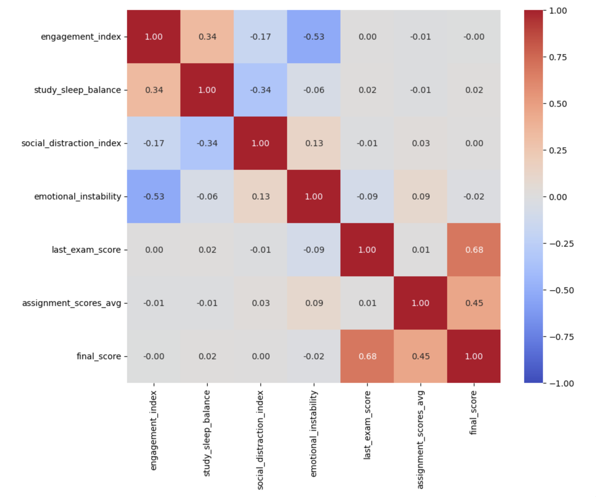

## Project Workflow
The project was developed as part of a course research project and followed several analytical stages:

1. **Literature and background review**
   - analysis of existing research on AI-assisted education
   - review of related solutions and approaches
   - collection and preparation of relevant datasets

2. **Exploratory Data Analysis (EDA)**
   - examination of dataset structure and variables
   - descriptive statistics and visualization
   - identification of patterns in user behavior and emotional signals

The notebook is too large for GitHub preview.

View the full notebook with outputs here:
➡️ https://nbviewer.org/github/MariaVasilyeva/AI-Emotion-Analysis/blob/main/02_exploratory_data_analysis.ipynb
**Example visualization**

3. **Hypothesis Testing**
   - formulation of research hypotheses
   - statistical analysis of relationships between emotional responses, user behavior, and performance

4. **Model Development**
   - building predictive models
   - evaluation of model performance
   - interpretation of results
